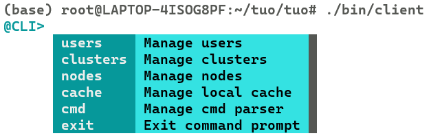
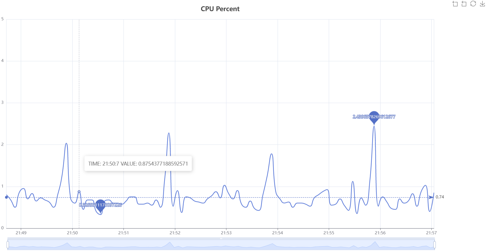

# Linux 集群管理及监控系统
1. Start components: `docker-compose up -d`
2. Build: `make all`
3. Start server: `./bin/server`
4. Start client: `./bin/client`

## TODO
- 基于snmp的监控
- 远程桌面 参考：[rust实现远程桌面](https://www.bilibili.com/video/BV1tZ4y1X7hT)
